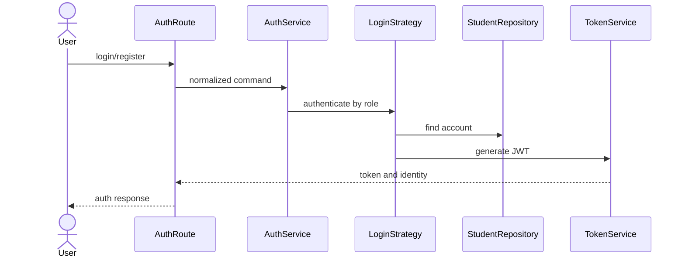
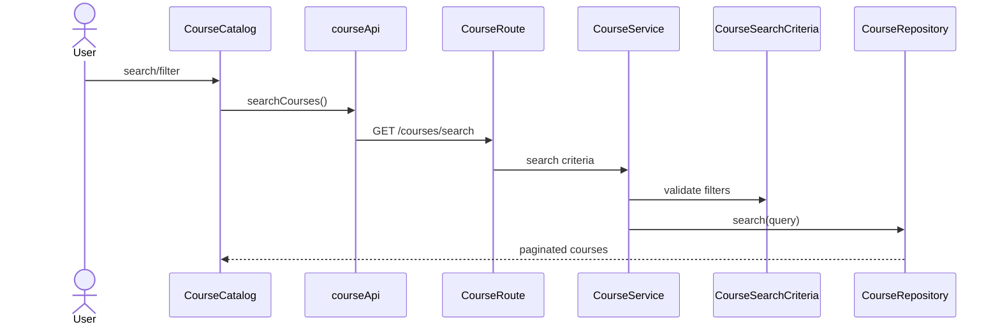
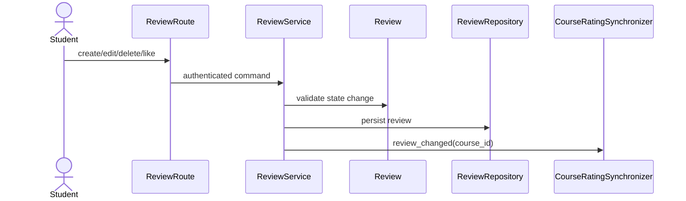
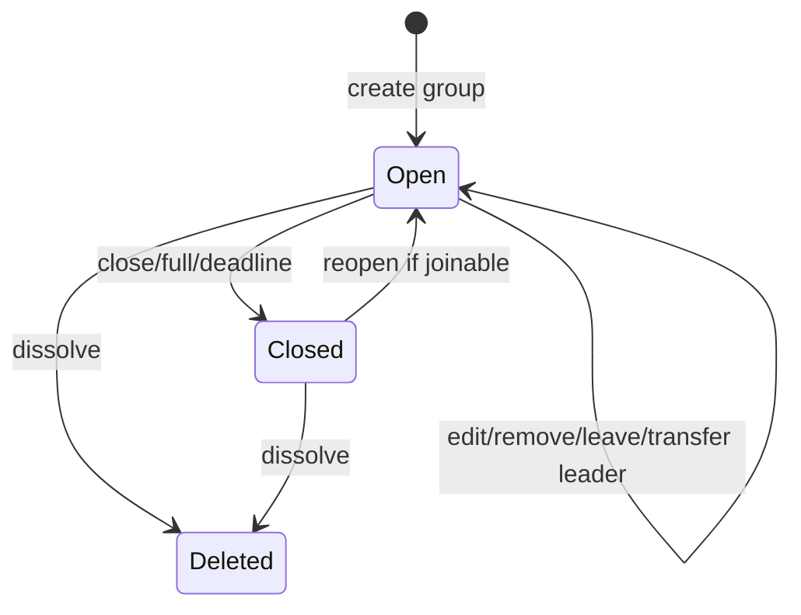
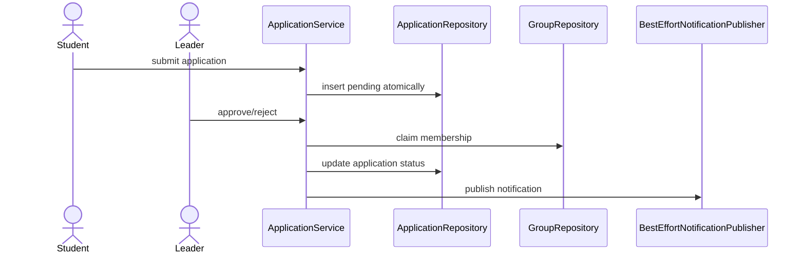
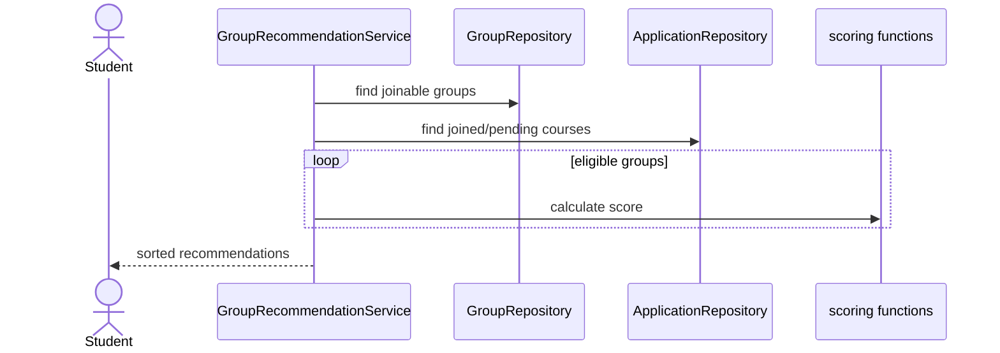
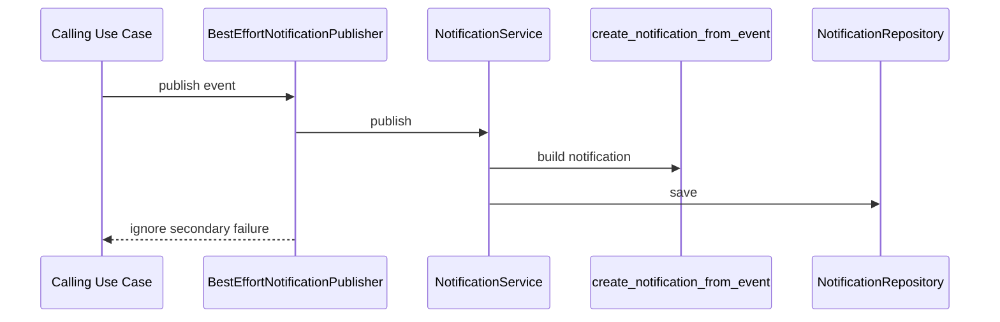
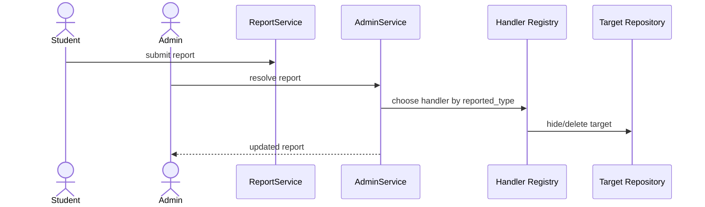
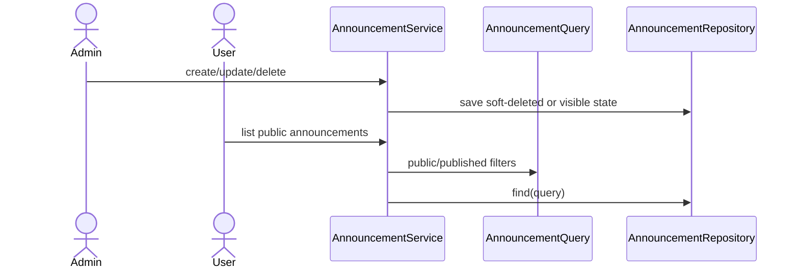
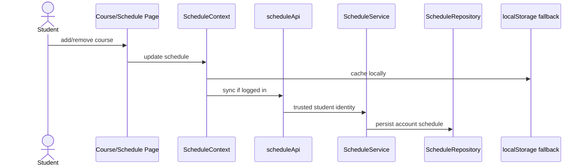

# 選課工具箱 — Course Toolbox

An integrated course information web app for NTNU (National Taiwan Normal University) students, combining course search, peer reviews, discussions, groupmate finding, personal schedule, and admin management in one platform.

---

## Tech Stack

| Layer | Technology |
|-------|-----------|
| Frontend | React + TypeScript (Vite) |
| Backend | Python + Flask (REST API) |
| Database | MongoDB Atlas (cloud, NoSQL) |
| DB driver | pymongo |
| Auth | JWT (PyJWT) |
| Avatar storage | GridFS (via pymongo) |
| Environment | `.env` file (connection string, secrets, ports) |

---

## Features

- **Course Search** — filter by keyword, department, semester, and more
- **Reviews** — write, edit, delete, and like course reviews; rating projection synced automatically
- **Discussions** — course-level threaded discussions and replies
- **Groupmates** — post and discover study groups, apply to join, recommendation scoring
- **Schedule** — personal course schedule synced to account; localStorage fallback when logged out
- **Notifications** — bell popover for application, review, report, and announcement events
- **Announcements** — admin-published site-wide announcements
- **Bookmarks** — save favorite courses
- **Achievements** — score-based badges shown on user profile
- **Admin Panel** — report audit queue, announcement management, analytics dashboard

---

## Project Structure

```
CourseReviewSystem/
├── frontend/                      # React + TypeScript (Vite)
│   ├── index.html
│   ├── vite.config.ts
│   ├── package.json
│   └── src/
│       ├── main.tsx               # React entry
│       ├── App.tsx                # Global providers and router
│       ├── routes.tsx             # Lazy-loaded route map and guards
│       ├── api/                   # Feature API clients (all go through apiClient.ts)
│       │   ├── apiClient.ts
│       │   ├── userApi.ts
│       │   ├── courseApi.ts
│       │   ├── reviewApi.ts
│       │   ├── discussionApi.ts
│       │   ├── groupApi.ts
│       │   ├── applicationApi.ts
│       │   ├── notificationApi.ts
│       │   ├── reportApi.ts
│       │   ├── announcementApi.ts
│       │   ├── bookmarkApi.ts
│       │   ├── scheduleApi.ts
│       │   ├── achievementApi.ts
│       │   └── adminAnalyticsApi.ts
│       ├── components/            # Shared and feature UI components
│       ├── context/               # AuthContext, ScheduleContext
│       ├── hooks/                 # UI-facing feature hooks
│       ├── models/                # Frontend DTO / type contracts
│       ├── pages/                 # Route-level page components
│       │   ├── Home.tsx
│       │   ├── CourseCatalog.tsx
│       │   ├── CourseDetail.tsx
│       │   ├── Reviews.tsx
│       │   ├── Discussions.tsx
│       │   ├── DiscussionDetail.tsx
│       │   ├── GroupmatesIntegrated.tsx
│       │   ├── Schedule.tsx
│       │   ├── UserProfile.tsx
│       │   ├── auth/
│       │   └── admin/
│       ├── config/                # API base URL config
│       ├── styles/                # Global styles
│       └── utils/                 # Shared helpers
│
├── backend/                       # Python + Flask
│   ├── app.py                     # Flask composition root
│   ├── mongo.py                   # MongoDB and GridFS connection
│   ├── departments.py             # Department data provider
│   ├── requirements.txt
│   ├── env.example                # Environment variable template
│   ├── models/                    # Domain models and invariants
│   │   ├── user.py
│   │   ├── course.py
│   │   ├── review.py
│   │   ├── discussion.py
│   │   ├── reply.py
│   │   ├── group.py
│   │   ├── application.py
│   │   ├── schedule.py
│   │   ├── notification.py
│   │   ├── report.py
│   │   ├── announcement.py
│   │   ├── bookmark.py
│   │   └── badge.py
│   ├── repository/                # MongoDB queries and atomic writes
│   │   ├── student_repository.py
│   │   ├── course_repository.py
│   │   ├── review_repository.py
│   │   ├── discussion_repository.py
│   │   ├── reply_repository.py
│   │   ├── group_repository.py
│   │   ├── application_repository.py
│   │   ├── schedule_repository.py
│   │   ├── notification_repository.py
│   │   ├── report_repository.py
│   │   ├── announcement_repository.py
│   │   ├── bookmark_repository.py
│   │   └── badge_repository.py
│   ├── routes/                    # HTTP adapters (Flask blueprints)
│   │   ├── auth_routes.py
│   │   ├── user_routes.py
│   │   ├── course_routes.py
│   │   ├── review_routes.py
│   │   ├── discussion_routes.py
│   │   ├── group_routes.py
│   │   ├── application_routes.py
│   │   ├── notification_routes.py
│   │   ├── report_routes.py
│   │   ├── admin_routes.py
│   │   ├── announcement_routes.py
│   │   ├── bookmark_routes.py
│   │   ├── schedule_routes.py
│   │   └── achievement_routes.py
│   ├── services/                  # Use case services grouped by feature
│   │   ├── auth/                  # Login strategies, JWT, authorization
│   │   ├── profile/               # User profile and avatar storage
│   │   ├── course/                # Course search and query
│   │   ├── review/                # Review lifecycle and rating sync
│   │   ├── discussion/            # Discussions and replies
│   │   ├── group/                 # Groups, applications, recommendation
│   │   ├── admin/                 # Report audit and analytics read model
│   │   ├── communication/         # Notification, announcement, report
│   │   └── engagement/            # Bookmark, achievement, schedule
│   ├── docs/                      # Algorithm and design documentation
│   ├── migrations/                # Data migration scripts
│   ├── scripts/                   # Seed and migration runners
│   └── tests/                     # Backend use case and integration tests
│
└── README.md
```

---

## Installation & Setup

### Prerequisites

- Node.js 18+ (frontend)
- Python 3.10+ (backend)
- A MongoDB Atlas account (or local MongoDB instance)

### Backend

```bash
cd backend

# Create and activate a virtual environment
python -m venv venv
source venv/bin/activate        # Windows: venv\Scripts\activate

# Install dependencies
pip install -r requirements.txt

# Set up environment variables
cp env.example .env
# Edit .env and fill in MONGO_URI, DB_NAME, JWT_SECRET, etc.

# Start the Flask server
python app.py
```

Backend runs at: `http://127.0.0.1:5001`

### Frontend

```bash
cd frontend
npm install
npm run dev
```

Frontend runs at: `http://localhost:5173`

---

## Environment Variables

Copy `backend/env.example` to `backend/.env` and fill in the values:

```env
# MongoDB Atlas connection string
MONGO_URI=mongodb+srv://<username>:<password>@<cluster>.mongodb.net/

# Database name
DB_NAME=Course

# Frontend URL (update to your Vercel URL in production)
FRONTEND_URL=http://localhost:5173

# Flask port (5001 recommended on macOS to avoid conflicts with system services)
PORT=5001

# Environment (development / production)
FLASK_ENV=development

# JWT signing secret — use a long random value in production
JWT_SECRET=replace_with_a_long_random_secret
JWT_ALGORITHM=HS256
JWT_EXPIRE_DAYS=1
```

> **Note:** Never commit `.env` to version control. It is already listed in `.gitignore`.

---

## Seed Data & Migrations

Run these once after setting up the database:

```bash
cd backend
python scripts/seed_courses.py   # import course data
python scripts/seed_badges.py    # create default achievement badges
```

If migrating group data (enforces membership uniqueness):

```bash
python scripts/migrate_group_data.py --dry-run   # preview changes
python scripts/migrate_group_data.py --apply      # apply changes
```

---

## Verification

Backend:

```bash
cd backend
python -m unittest discover -s tests -v
python -m compileall .
```

Frontend:

```bash
cd frontend
npm run lint
npm run build
```

---

## Architecture Overview


### Layer Responsibilities

| Layer | Owns | Does Not Own |
|-------|------|-------------|
| Frontend page/component | UI state, layout, user events | Backend business rules |
| Frontend hook | UI orchestration for one feature | Raw HTTP details |
| Frontend API client | Endpoint calls and response types | Rendering |
| Route | Request parsing, auth guard, response code | Use case logic |
| Service | Use case orchestration | Flask request or Mongo document details |
| Domain model | State transitions and invariants | Database or HTTP |
| Repository | Queries, mapping, atomic writes | UI or cross-use-case flow |

### Design Patterns

| Pattern | Where | Purpose |
|---------|-------|---------|
| Repository | `backend/repository/` | Hide MongoDB queries and document mapping |
| Dependency Injection | `backend/app.py` | Wire services once; keep tests replaceable |
| Strategy | Auth login, admin report handlers | Select behavior by role or reported target |
| Factory Method | `StudentRegistrationFactory` | Validate and build `Student` consistently |
| Adapter | `GridFSAvatarStorage`, `apiClient.ts` | Hide GridFS/HTTP details behind stable methods |
| Query Object | `CourseSearchCriteria`, `AnnouncementQuery` | Keep query normalization out of routes |
| Decorator | Route guards, `BestEffortNotificationPublisher` | Add auth/best-effort behavior around core use cases |
| Read Model | `AdminAnalyticsService`, `GroupDashboardService` | Return UI-ready aggregate data |
| Synchronizer | `CourseRatingSynchronizer` | Recalculate course rating after review changes |

---

## Branch Strategy

```
main        stable production branch
develop     integration branch
usecase/*   feature branch per use case
```

Create feature branches from `develop`, then open a PR back to `develop` after tests pass.

---

## Key Behavior Notes

**Course ID format:**

```
{serialNumber}_{academicYear}_{semester}
```

Example: `0691_113_2`. The UI displays the shorter `serialNumber`, but reviews, bookmarks, discussions, groups, schedule, and API routes all use the full `courseID`.

**Groupmate "All" mode** excludes closed, full, expired, or hidden groups, and groups for courses where the user already has membership or a pending application.

**Schedule** is synced to the user's account when logged in. `localStorage` is used only as an unauthenticated/offline fallback cache.

**Notification UI** is a popover (`NotificationPopover.tsx`) beside the profile avatar — intentionally not a full page.

**Achievements** are integrated into the User Profile page; `/achievements` redirects to `/profile`.

---

## Further Reading

- [Group recommendation algorithm](backend/docs/recommendation_algorithm.md)
- [Achievement score algorithm](backend/docs/achievement_score_algorithm.md)
- [Discussion sorting strategy pattern](backend/docs/discussion_Sorting_Strategy_Pattern.md)

---

## Appendix A: File Responsibility Map

### Backend

| Area | Files | Responsibility |
|------|-------|---------------|
| App root | `backend/app.py` | Flask app factory, CORS, dependency composition, blueprint registration |
| Database | `backend/mongo.py` | MongoDB and GridFS connection |
| Domain models | `backend/models/` | Domain state, validation, invariants, lifecycle behavior |
| Repositories | `backend/repository/` | MongoDB queries, mapping, atomic writes, index-backed constraints |
| Routes | `backend/routes/` | HTTP request parsing, auth guard usage, response shape, status codes |
| Auth services | `backend/services/auth/` | Login strategies, JWT, password hashing, route authorization |
| Profile services | `backend/services/profile/` | User profile updates and avatar storage adapter |
| Course services | `backend/services/course/` | Course search/query orchestration |
| Review services | `backend/services/review/` | Review lifecycle and course rating synchronization |
| Discussion services | `backend/services/discussion/` | Discussion and reply use cases |
| Group services | `backend/services/group/` | Group lifecycle, applications, management dashboard, recommendation |
| Admin services | `backend/services/admin/` | Admin report handling and analytics read model |
| Communication services | `backend/services/communication/` | Notification, announcement, report submit/query flows |
| Engagement services | `backend/services/engagement/` | Bookmark, achievement, schedule use cases |
| Docs | `backend/docs/` | Algorithm and migration documentation |
| Migrations/scripts | `backend/migrations/`, `backend/scripts/` | Data migration, seed, maintenance runners |
| Tests | `backend/tests/` | Use case tests and regression tests |

### Frontend

| Area | Files | Responsibility |
|------|-------|---------------|
| App root | `frontend/src/main.tsx`, `frontend/src/App.tsx` | React entry and global providers |
| Routing | `frontend/src/routes.tsx` | Route map, lazy loading, route guards |
| API layer | `frontend/src/api/` | Feature API clients; all HTTP goes through `apiClient.ts` |
| Context | `frontend/src/context/` | Auth session state and schedule state |
| Hooks | `frontend/src/hooks/` | UI-facing feature orchestration |
| Pages | `frontend/src/pages/` | Route-level composition and page layout |
| Components | `frontend/src/components/` | Shared UI and feature components |
| Models | `frontend/src/models/` | Shared frontend DTO/type contracts |
| Config/styles | `frontend/src/config/`, `frontend/src/styles/` | API config and global styles |

---

## Appendix B: Use Case Diagrams

### Auth



### Course Search



### Review Lifecycle



### Group Lifecycle



### Group Application



### Group Recommendation



### Notification



### Admin Report Handling



### Announcement



### Schedule Sync



---

## Appendix C: File Index

### Backend Core

| File | Purpose |
|------|---------|
| `backend/app.py` | Flask composition root; creates repositories/services and registers routes |
| `backend/mongo.py` | MongoDB and GridFS connection |
| `backend/departments.py` | Department data provider for registration/profile UI |
| `backend/requirements.txt` | Backend Python dependencies |
| `backend/env.example` | Backend environment variable template |

### Backend Models

| File | Purpose |
|------|---------|
| `models/user.py` | User, Student, Admin profile data and counters |
| `models/course.py` | Course entity and `CourseSearchCriteria` |
| `models/review.py` | Review validation, edit, like, visibility behavior |
| `models/discussion.py` | Discussion and reply domain behavior |
| `models/reply.py` | Reply domain behavior |
| `models/group.py` | Group lifecycle and membership invariants |
| `models/application.py` | Group application status lifecycle |
| `models/schedule.py` | Account schedule course snapshots |
| `models/notification.py` | Notification entity and event template mapping |
| `models/report.py` | Report reasons, status, resolve/withdraw behavior |
| `models/announcement.py` | Announcement entity and query object |
| `models/bookmark.py` | Bookmark entity |
| `models/badge.py` | Badge entity, validation, eligibility rule |

### Backend Repositories

| File | Purpose |
|------|---------|
| `announcement_repository.py` | Announcement queries, active count, save |
| `application_repository.py` | Application insert/update/query operations |
| `badge_repository.py` | Badge lookup and persistence |
| `bookmark_repository.py` | Bookmark idempotent insert/delete/count |
| `course_repository.py` | Course search and lookup |
| `discussion_repository.py` | Discussion persistence and counters |
| `group_repository.py` | Group lifecycle persistence, membership checks, recommendation queries |
| `notification_repository.py` | Notification query, save, mark read |
| `reply_repository.py` | Reply persistence, lookup, hide/delete |
| `report_repository.py` | Report query, save, duplicate prevention, counts |
| `review_repository.py` | Review CRUD, visibility, like, course aggregation source |
| `schedule_repository.py` | Account schedule persistence |
| `student_repository.py` | Student/admin lookup, update, uniqueness helpers |

### Backend Routes

| File | Purpose |
|------|---------|
| `auth_routes.py` | Login/register HTTP adapter |
| `user_routes.py` | Profile, avatar, departments HTTP adapter |
| `course_routes.py` | Course search/detail HTTP adapter |
| `review_routes.py` | Review lifecycle HTTP adapter |
| `discussion_routes.py` | Discussion/reply HTTP adapter |
| `group_routes.py` | Group lifecycle and recommendation HTTP adapter |
| `application_routes.py` | Group application HTTP adapter |
| `notification_routes.py` | Notification list/read HTTP adapter |
| `report_routes.py` | Student report submit/query/withdraw HTTP adapter |
| `admin_routes.py` | Admin audit, announcement, analytics HTTP adapter |
| `announcement_routes.py` | Public announcement HTTP adapter |
| `bookmark_routes.py` | Bookmark HTTP adapter |
| `schedule_routes.py` | Account schedule HTTP adapter |
| `achievement_routes.py` | Achievement score/badge HTTP adapter |

### Backend Services

| File | Purpose |
|------|---------|
| `services/auth/auth_service.py` | Registration factory and login strategies |
| `services/auth/authorization_service.py` | JWT identity extraction and route guards |
| `services/auth/password_service.py` | Password hashing and verification |
| `services/auth/token_service.py` | JWT generation and verification |
| `services/profile/user_service.py` | Profile and avatar use cases |
| `services/profile/avatar_storage.py` | GridFS avatar adapter |
| `services/course/course_service.py` | Course query use case |
| `services/review/review_service.py` | Review lifecycle orchestration |
| `services/review/course_rating_synchronizer.py` | Course rating projection sync after review changes |
| `services/discussion/discussion_service.py` | Discussion/reply use cases |
| `services/group/group_service.py` | Group lifecycle orchestration |
| `services/group/application_service.py` | Group application submit/approve/reject/cancel |
| `services/group/group_dashboard_service.py` | Profile group management read model |
| `services/group/group_recommendation_service.py` | Group recommendation orchestration |
| `services/group/group_recommendation_scoring.py` | Recommendation scoring functions |
| `services/admin/admin_service.py` | Admin report handler registry and actions |
| `services/admin/admin_analytics_service.py` | Admin dashboard summary read model |
| `services/communication/notification_service.py` | Notification publish/read and best-effort publisher |
| `services/communication/announcement_service.py` | Announcement lifecycle |
| `services/communication/report_service.py` | Student report submit/query/withdraw |
| `services/engagement/favorite_service.py` | Bookmark use cases |
| `services/engagement/achievement_service.py` | Achievement score and highest eligible badge selection |
| `services/engagement/schedule_service.py` | Account schedule sync use cases |

### Backend Scripts, Migrations, Tests

| File | Purpose |
|------|---------|
| `migrations/group_data_migration.py` | Group/application data normalization and index setup |
| `scripts/migrate_group_data.py` | CLI runner for group migration |
| `scripts/seed_courses.py` | Course seed/import runner |
| `scripts/seed_badges.py` | Default badge seed runner |
| `tests/test_*_use_case.py` | Backend use case unit tests |
| `tests/test_group_api_integration.py` | Group API integration flow |
| `tests/test_group_migration.py` | Migration dry-run/apply/conflict tests |

### Frontend API

| File | Purpose |
|------|---------|
| `api/apiClient.ts` | Shared HTTP adapter, auth headers, response parsing |
| `api/userApi.ts` | Auth/profile/departments/avatar API |
| `api/courseApi.ts` | Course search/detail API and schedule parser |
| `api/reviewApi.ts` | Review API |
| `api/discussionApi.ts` | Discussion/reply API |
| `api/groupApi.ts` | Group lifecycle and dashboard API |
| `api/applicationApi.ts` | Group application API |
| `api/notificationApi.ts` | Notification list/read API |
| `api/reportApi.ts` | Student/admin report API |
| `api/announcementApi.ts` | Admin/public announcement API |
| `api/bookmarkApi.ts` | Bookmark API |
| `api/scheduleApi.ts` | Account schedule API |
| `api/achievementApi.ts` | Achievement score/badge API |
| `api/adminAnalyticsApi.ts` | Admin analytics summary API |

### Frontend Context, Hooks, and Pages

| File | Purpose |
|------|---------|
| `context/AuthContext.tsx` | Auth user/session state and auth localStorage ownership |
| `context/ScheduleContext.tsx` | Schedule state, backend sync, local fallback cache |
| `hooks/useUserProfile.ts` | Profile page data/controller hook |
| `hooks/useGroupmateDiscovery.ts` | Groupmate discovery data/filter/action hook |
| `hooks/useNotifications.ts` | Notification popover data/controller hook |
| `pages/Home.tsx` | Landing page |
| `pages/CourseCatalog.tsx` | Course search/list page |
| `pages/CourseDetail.tsx` | Course detail, reviews, discussions, add schedule |
| `pages/Reviews.tsx` | Review list/create page |
| `pages/Discussions.tsx` | Discussion list/create page |
| `pages/DiscussionDetail.tsx` | Single discussion and replies |
| `pages/GroupmatesIntegrated.tsx` | Groupmate discovery composition page |
| `pages/Schedule.tsx` | Personal schedule page |
| `pages/UserProfile.tsx` | Profile tabs composition page |
| `pages/auth/Login.tsx` | Login page |
| `pages/auth/Register.tsx` | Register page |
| `pages/admin/AdminLayout.tsx` | Admin dashboard layout |
| `pages/admin/AuditCenter.tsx` | Admin report review queue |
| `pages/admin/AnnouncementEditor.tsx` | Announcement management page |
