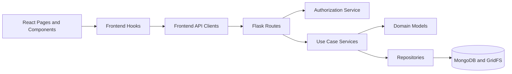

# 選課工具箱 — NTNU Toolbox

An integrated course information web app for NTNU (National Taiwan Normal University) students, combining course search, peer reviews, discussions, groupmate finding, personal schedule, and admin management in one platform.

---

## 1. Tech Stack

| Layer | Technology |
|-------|-----------|
| Frontend | React + TypeScript (Vite) |
| Backend | Python + Flask (REST API) |
| Database | MongoDB Atlas (cloud, NoSQL) |
| DB driver | pymongo |
| Auth | JWT (PyJWT) |
| Avatar storage | GridFS (via pymongo) |
| Environment | `.env` file (connection string, secrets, ports) |

---

## 2. Features

- **Course Search** — filter by keyword, department, semester, and more
- **Reviews** — write, edit, delete, and like course reviews; rating projection synced automatically
- **Discussions** — course-level threaded discussions and replies
- **Groupmates** — post and discover study groups, apply to join, recommendation scoring
- **Schedule** — personal course schedule synced to account; localStorage fallback when logged out
- **Notifications** — bell popover for application, review, report, and announcement events
- **Announcements** — admin-published site-wide announcements
- **Bookmarks** — save favorite courses
- **Achievements** — score-based badges shown on user profile
- **Admin Panel** — report audit queue, announcement management, analytics dashboard

---

## 3. Project Structure

All source code is placed under one root folder: CourseReviewSystem/.
The project is divided into frontend/ and backend/ according to the system architecture. The frontend handles user interface and API calls, while the backend handles REST routes, use case services, domain models, repositories, and database access.

```
CourseReviewSystem/
├── frontend/                      # React + TypeScript (Vite)
│   ├── index.html
│   ├── vite.config.ts
│   ├── package.json
│   └── src/
│       ├── main.tsx               # React entry
│       ├── App.tsx                # Global providers and router
│       ├── routes.tsx             # Lazy-loaded route map and guards
│       ├── api/                   # Feature API clients (all go through apiClient.ts)
│       │   ├── apiClient.ts
│       │   ├── userApi.ts
│       │   ├── courseApi.ts
│       │   ├── reviewApi.ts
│       │   ├── discussionApi.ts
│       │   ├── groupApi.ts
│       │   ├── applicationApi.ts
│       │   ├── notificationApi.ts
│       │   ├── reportApi.ts
│       │   ├── announcementApi.ts
│       │   ├── bookmarkApi.ts
│       │   ├── scheduleApi.ts
│       │   ├── achievementApi.ts
│       │   └── adminAnalyticsApi.ts
│       ├── components/            # Shared and feature UI components
│       ├── context/               # AuthContext, ScheduleContext
│       ├── hooks/                 # UI-facing feature hooks
│       ├── models/                # Frontend DTO / type contracts
│       ├── pages/                 # Route-level page components
│       │   ├── Home.tsx
│       │   ├── CourseCatalog.tsx
│       │   ├── CourseDetail.tsx
│       │   ├── Reviews.tsx
│       │   ├── Discussions.tsx
│       │   ├── DiscussionDetail.tsx
│       │   ├── GroupmatesIntegrated.tsx
│       │   ├── Schedule.tsx
│       │   ├── UserProfile.tsx
│       │   ├── auth/
│       │   └── admin/
│       ├── config/                # API base URL config
│       ├── styles/                # Global styles
│       └── utils/                 # Shared helpers
│
├── backend/                       # Python + Flask
│   ├── app.py                     # Flask composition root
│   ├── mongo.py                   # MongoDB and GridFS connection
│   ├── departments.py             # Department data provider
│   ├── requirements.txt
│   ├── env.example                # Environment variable template
│   ├── models/                    # Domain models and invariants
│   │   ├── user.py
│   │   ├── course.py
│   │   ├── review.py
│   │   ├── discussion.py
│   │   ├── reply.py
│   │   ├── group.py
│   │   ├── application.py
│   │   ├── schedule.py
│   │   ├── notification.py
│   │   ├── report.py
│   │   ├── announcement.py
│   │   ├── bookmark.py
│   │   └── badge.py
│   ├── repository/                # MongoDB queries and atomic writes
│   │   ├── student_repository.py
│   │   ├── course_repository.py
│   │   ├── review_repository.py
│   │   ├── discussion_repository.py
│   │   ├── reply_repository.py
│   │   ├── group_repository.py
│   │   ├── application_repository.py
│   │   ├── schedule_repository.py
│   │   ├── notification_repository.py
│   │   ├── report_repository.py
│   │   ├── announcement_repository.py
│   │   ├── bookmark_repository.py
│   │   └── badge_repository.py
│   ├── routes/                    # HTTP adapters (Flask blueprints)
│   │   ├── auth_routes.py
│   │   ├── user_routes.py
│   │   ├── course_routes.py
│   │   ├── review_routes.py
│   │   ├── discussion_routes.py
│   │   ├── group_routes.py
│   │   ├── application_routes.py
│   │   ├── notification_routes.py
│   │   ├── report_routes.py
│   │   ├── admin_routes.py
│   │   ├── announcement_routes.py
│   │   ├── bookmark_routes.py
│   │   ├── schedule_routes.py
│   │   └── achievement_routes.py
│   ├── services/                  # Use case services grouped by feature
│   │   ├── auth/                  # Login strategies, JWT, authorization
│   │   ├── profile/               # User profile and avatar storage
│   │   ├── course/                # Course search and query
│   │   ├── review/                # Review lifecycle and rating sync
│   │   ├── discussion/            # Discussions and replies
│   │   ├── group/                 # Groups, applications, recommendation
│   │   ├── admin/                 # Report audit and analytics read model
│   │   ├── communication/         # Notification, announcement, report
│   │   └── engagement/            # Bookmark, achievement, schedule
│   ├── docs/                      # Algorithm and design documentation
│   ├── migrations/                # Data migration scripts
│   ├── scripts/                   # Seed and migration runners
│   └── tests/                     # Backend use case and integration tests
│
└── README.md
```

---

## 4. Folder Responsibilities

| Folder                     | Responsibility                                            |
| -------------------------- | --------------------------------------------------------- |
| `frontend/src/pages/`      | Route-level page components                               |
| `frontend/src/components/` | Shared and feature UI components                          |
| `frontend/src/api/`        | API clients for communicating with the backend            |
| `frontend/src/context/`    | Global frontend state such as authentication and schedule |
| `frontend/src/hooks/`      | UI-facing feature logic                                   |
| `frontend/src/models/`     | Frontend TypeScript types and DTOs                        |
| `backend/routes/`          | Flask blueprints and HTTP request handling                |
| `backend/services/`        | Use case logic and feature orchestration                  |
| `backend/models/`          | Domain models and business invariants                     |
| `backend/repository/`      | MongoDB queries and database operations                   |
| `backend/scripts/`         | Seed and migration runners                                |


---

## 5. Architecture Overview



The code organization follows this architecture:

* Frontend pages and components handle UI rendering and user interaction.
* Frontend API clients send requests to the Flask backend.
* Flask routes parse requests, check authentication, and return responses.
* Services contain the main use case logic.
* Domain models define data rules and state changes.
* Repositories handle MongoDB access and atomic writes.

---

## 6. Installation and Setup

### Prerequisites

* Node.js 18 or above
* Python 3.10 or above
* MongoDB Atlas account or local MongoDB instance

---

### Backend Setup

```bash
cd backend

python -m venv venv
source venv/bin/activate
```

For Windows:

```bash
venv\Scripts\activate
```

Install dependencies:

```bash
pip install -r requirements.txt
```

Create the environment file:

Create frontend/.env based on frontend/env.example.

Create `backend/.env` based on `backend/env.example`.

Edit `.env` and fill in the required values.

Start the backend server:

```bash
python app.py
```

Backend default URL:

```text
http://127.0.0.1:5001
```

---

### Frontend Setup

```bash
cd frontend
npm install
npm run dev
```

Frontend default URL:

```text
http://localhost:5173
```
---

## 7. Verification

Run backend checks:

```bash
cd backend
python -m unittest discover -s tests -v
python -m compileall .
```

Run frontend checks:

```bash
cd frontend
npm run lint
npm run build
```

---

## 8. Key Behavior Notes

### Course ID Format

The system uses the following course ID format:

```text
{serialNumber}_{academicYear}_{semester}
```

Example:

```text
0691_113_2
```

The UI may display the shorter serial number, but reviews, bookmarks, discussions, groups, schedules, and API routes use the full `courseID`.

### Schedule

The schedule is synced to the user's account after login. `localStorage` is used only as a fallback for unauthenticated or offline use.

### Notifications

Notifications are shown through a bell popover beside the profile avatar. They are not implemented as a separate full page.

### Achievements

Achievements are integrated into the user profile page. The `/achievements` route redirects to `/profile`.

---

## 9. Further Reading

* `backend/docs/recommendation_algorithm.md`
* `backend/docs/achievement_score_algorithm.md`
* `backend/docs/discussion_Sorting_Strategy_Pattern.md`


