# Course Review System

師大課程評價、討論、找組員、課表與管理平台。

Frontend: React + TypeScript + Vite  
Backend: Flask + MongoDB

## Status

已完成第一輪責任拆分的核心 use cases：

- Auth、User Profile、Course Search
- Review、Discussion、Reply
- Group lifecycle、Application、Recommendation
- Notification、Report、Admin Audit、Announcement
- Bookmark、Achievement、Schedule


近期已完成整理：

- Achievements 整合在 UserProfile，不做獨立大頁；`/achievements` 會導回 `/profile`。
- Notification 是右上角 Bell popover，不做獨立頁面。
- Frontend API 統一走 `frontend/src/api/apiClient.ts`。
- Auth session storage 統一由 `AuthContext` 與 `apiClient` 管理。
- Admin analytics 已改成後端 read model：`GET /admin/analytics/summary`。
- Vite route lazy loading 已拆分 page chunks，首頁入口 bundle 低於 500 kB。

## Quick Start

Backend:

```bash
cd backend
python -m venv venv
source venv/bin/activate
pip install -r requirements.txt
cp env.example .env
python app.py
```

Frontend:

```bash
cd frontend
npm install
cp env.example .env.local
npm run dev
```

Default URLs:

- Backend: `http://127.0.0.1:5001`
- Frontend: `http://localhost:5173`

Production must set a strong `JWT_SECRET`.

## Project Structure

```text
backend/
  app.py                  Flask composition root
  models/                 Domain models and invariants
  repository/             MongoDB access and atomic writes
  routes/                 HTTP adapters
  services/               Use case services, grouped by feature
  docs/                   Algorithm and migration notes
  migrations/             Data migration code
  scripts/                Seed and migration runners
  tests/                  Backend use case tests

frontend/
  src/api/                Feature API clients
  src/components/         Shared and feature components
  src/context/            Auth and schedule contexts
  src/hooks/              UI-facing use case hooks
  src/models/             Shared frontend contracts
  src/pages/              Route pages
  src/routes.tsx          Route map and lazy loading
```

Backend services are grouped by responsibility:

```text
services/auth/            login, JWT, authorization, password
services/profile/         user profile and avatar storage
services/course/          course query
services/review/          review and rating projection
services/discussion/      discussions and replies
services/group/           groups, applications, management, recommendation
services/admin/           audit handling and analytics read model
services/communication/   notification, announcement, report
services/engagement/      bookmark, achievement, schedule
```

## Architecture Rules

| Layer | Should Own | Should Not Own |
| --- | --- | --- |
| Frontend page/component | UI state, layout, user events | Backend business rules |
| Frontend hook | UI orchestration for one feature | Raw HTTP details |
| Frontend API client | Endpoint calls and response types | Rendering |
| Route | Request parsing, auth guard, response code | Use case logic |
| Service | Use case orchestration | Flask request or Mongo document details |
| Domain model | State transitions and invariants | Database or HTTP |
| Repository | Queries, mapping, atomic writes | UI or cross-use-case flow |

Important current patterns:

- `backend/app.py` is the composition root.
- Services receive repositories/collaborators by constructor injection.
- `AuthorizationService` guards protected routes.
- `CourseRatingSynchronizer` updates course rating projection after review changes.
- `GroupManagementFacade` builds profile group dashboard data.
- `AdminAnalyticsService` builds admin dashboard read models.
- `BestEffortNotificationPublisher` prevents notification failures from breaking core flows.

## Main Use Cases

| Use Case | Main Files | Pattern Notes |
| --- | --- | --- |
| Auth | `services/auth/`, `routes/auth_routes.py` | Strategy, Factory, JWT service |
| User Profile | `services/profile/`, `routes/user_routes.py` | Service layer, GridFS adapter |
| Course Search | `course_service.py`, `CourseSearchCriteria` | Query object, repository |
| Review | `review_service.py`, `Review`, `CourseRatingSynchronizer` | Domain model, synchronizer |
| Discussion | `discussion_service.py`, `Discussion`, `Reply` | Domain model, repository |
| Group | `services/group/`, `Group` | Lifecycle model, facade |
| Application | `application_service.py`, `Application` | Atomic insert, compensating action |
| Recommendation | `group_recommendation_service.py` | Strategy scoring |
| Notification | `notification_service.py`, `NotificationFactory` | Factory, best-effort decorator |
| Report/Admin Audit | `report_service.py`, `admin_service.py` | Handler registry |
| Announcement | `announcement_service.py`, `AnnouncementQuery` | Query object, soft delete |
| Bookmark | `favorite_service.py`, `BookmarkFactory` | Idempotent insert |
| Achievement | `achievement_service.py` | Strategy, specification |
| Schedule | `schedule_service.py`, `ScheduleContext` | Account sync, local fallback |

More detail:

- Group recommendation formula: [backend/docs/recommendation_algorithm.md](backend/docs/recommendation_algorithm.md)
- Achievement score formula: [backend/docs/achievement_score_algorithm.md](backend/docs/achievement_score_algorithm.md)
- Group migration: [backend/docs/group_data_migration.md](backend/docs/group_data_migration.md)

## Behavior Notes

Course IDs use this format:

```text
{serialNumber}_{academicYear}_{semester}
```

Example:

```text
0691_113_2
```

UI usually displays the friendlier `serialNumber`, but reviews, bookmarks, discussions, groups, schedule, and API routes use the full `courseID`.

Groupmate “All” mode means all joinable/recommendable groups. It excludes:

- closed, full, expired, or hidden groups
- groups for courses the user already joined
- groups for courses where the user already has a pending application

Schedule is synced to the account when logged in. `localStorage` remains only as unauthenticated/offline fallback cache.

## Frontend Notes

Feature API clients live in `frontend/src/api/` and must call `apiClient.ts`.

Pages/components should not call `fetch` directly. Auth `localStorage` should stay inside `AuthContext` and `apiClient`.

Notification UI is `components/notifications/NotificationPopover.tsx`. It is intentionally a small popover beside the profile area, not a page.

Groupmate study-style labels are Traditional Chinese in the UI, while stable internal tag values remain lowercase keys such as `pair`, `group`, `flexible`, `online`, `in-person`, and `hybrid`.

## Migration And Seed

Before enforcing group membership uniqueness in production:

```bash
cd backend
python scripts/migrate_group_data.py --dry-run
python scripts/migrate_group_data.py --apply
```

Seed data:

```bash
cd backend
python scripts/seed_courses.py
python scripts/seed_badges.py
```

## Verification

Backend:

```bash
cd backend
python -m unittest discover -s tests -v
python -m compileall .
```

Frontend:

```bash
cd frontend
npm run lint
npm run build
```

If local Python lacks dependencies such as `flask`, `pymongo`, or `pytest`, install `backend/requirements.txt` in the backend virtual environment first.

## Branch Strategy

```text
main        stable production branch
develop     integration branch
usecase/*   feature branch per use case
```

Create feature branches from `develop`, then merge back through PR after tests pass.

## Appendix A: File Responsibility Map

### Backend

| Area | Files | Responsibility |
| --- | --- | --- |
| App root | `backend/app.py` | Flask app factory, CORS, dependency composition, blueprint registration |
| Database | `backend/mongo.py` | MongoDB and GridFS connection |
| Domain models | `backend/models/` | Domain state, validation, invariants, lifecycle behavior |
| Repositories | `backend/repository/` | MongoDB queries, mapping, atomic writes, index-backed constraints |
| Routes | `backend/routes/` | HTTP request parsing, auth guard usage, response shape, status codes |
| Auth services | `backend/services/auth/` | Login strategies, JWT, password hashing, route authorization |
| Profile services | `backend/services/profile/` | User profile updates and avatar storage adapter |
| Course services | `backend/services/course/` | Course search/query orchestration |
| Review services | `backend/services/review/` | Review lifecycle and course rating synchronization |
| Discussion services | `backend/services/discussion/` | Discussion and reply use cases |
| Group services | `backend/services/group/` | Group lifecycle, applications, management dashboard, recommendation |
| Admin services | `backend/services/admin/` | Admin report handling and analytics read model |
| Communication services | `backend/services/communication/` | Notification, announcement, report submit/query flows |
| Engagement services | `backend/services/engagement/` | Bookmark, achievement, schedule use cases |
| Docs | `backend/docs/` | Algorithm and migration documentation |
| Migrations/scripts | `backend/migrations/`, `backend/scripts/` | Data migration, seed, maintenance runners |
| Tests | `backend/tests/` | Use case tests and regression tests |

### Frontend

| Area | Files | Responsibility |
| --- | --- | --- |
| App root | `frontend/src/main.tsx`, `frontend/src/App.tsx` | React entry and global providers |
| Routing | `frontend/src/routes.tsx` | Route map, lazy loading, route guards |
| API layer | `frontend/src/api/` | Feature API clients; all HTTP goes through `apiClient.ts` |
| Context | `frontend/src/context/` | Auth session state and schedule state |
| Hooks | `frontend/src/hooks/` | UI-facing feature orchestration |
| Pages | `frontend/src/pages/` | Route-level composition and page layout |
| Components | `frontend/src/components/` | Shared UI and feature components |
| Models | `frontend/src/models/` | Shared frontend DTO/type contracts |
| Config/styles | `frontend/src/config/`, `frontend/src/styles/` | API config and global styles |

## Appendix B: Design Pattern Index

| Pattern | Where | Why |
| --- | --- | --- |
| Repository | `backend/repository/` | Keeps MongoDB details out of services and domain models |
| Dependency Injection | `backend/app.py` | Wires services/repositories once and keeps tests replaceable |
| Strategy | Auth login, group recommendation, achievement score, admin report handlers | Keeps variable rules out of large condition-heavy services |
| Factory Method | Student registration, notification, bookmark | Centralizes domain object creation and normalization |
| Facade | `GroupManagementFacade` | Builds profile group dashboard data from multiple sources |
| Adapter | `GridFSAvatarStorage`, `frontend/src/api/apiClient.ts` | Hides external/storage/HTTP details behind stable interfaces |
| Query Object | `CourseSearchCriteria`, `AnnouncementQuery` | Encapsulates query filters and validation |
| Specification | Badge eligibility | Expresses achievement eligibility rules cleanly |
| Decorator | Authorization guards, `BestEffortNotificationPublisher` | Adds cross-cutting behavior without polluting use cases |
| Synchronizer / Observer-style collaborator | `CourseRatingSynchronizer` | Updates course rating projection after review changes |
| Read Model | `AdminAnalyticsService`, `GroupManagementFacade` | Produces UI-ready data without pushing aggregation into pages |
| Compensating Action | Review/application/group/avatar flows | Repairs partial writes when multi-step operations fail |
| Container + Presentational split | `useUserProfile`, `useGroupmateDiscovery`, feature panels | Hooks own orchestration; components own display |

## Appendix C: Use Case Diagrams

### Overall Architecture

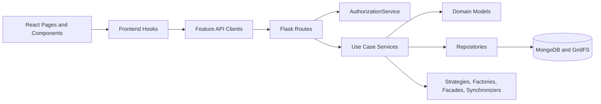

### Auth

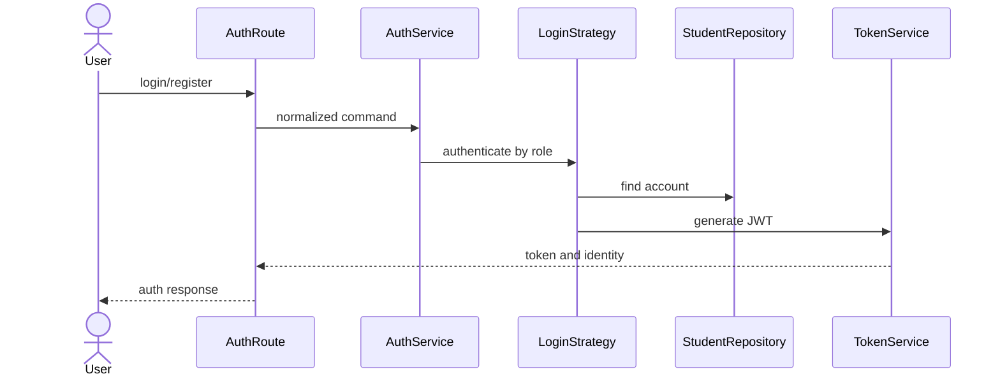

### Course Search

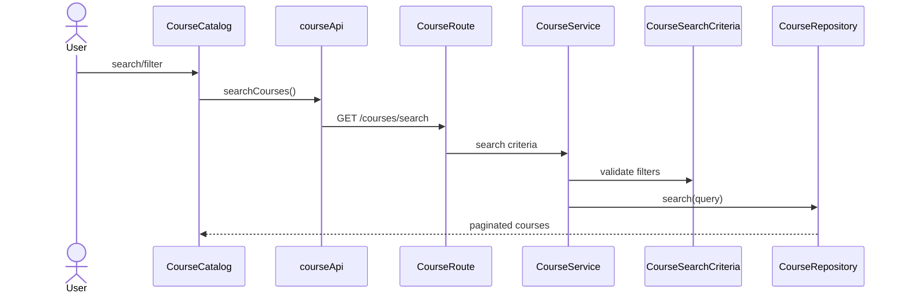

### Review Lifecycle

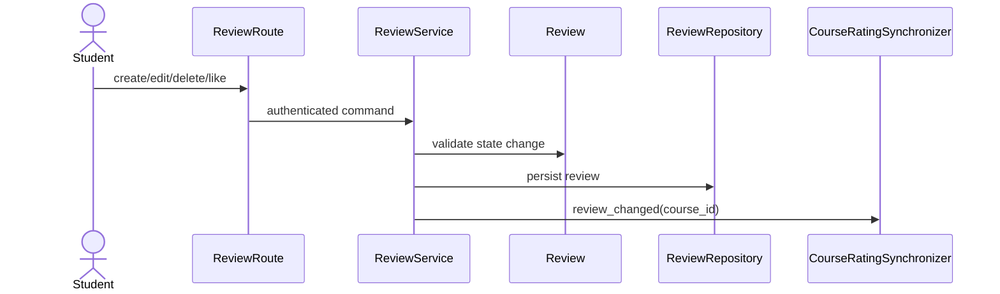

### Group Lifecycle

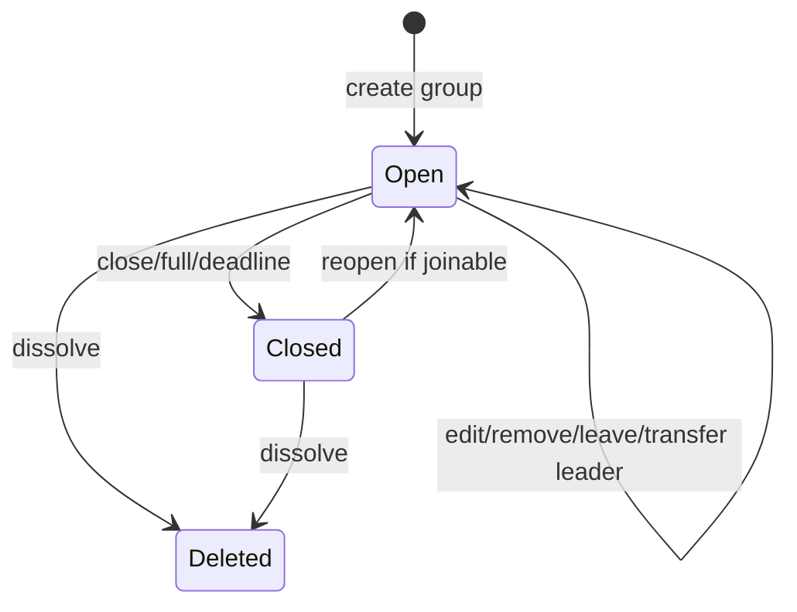

### Group Application

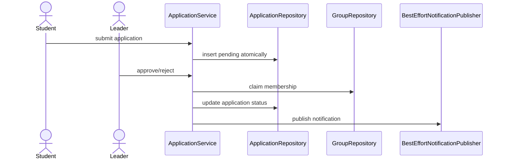

### Group Recommendation

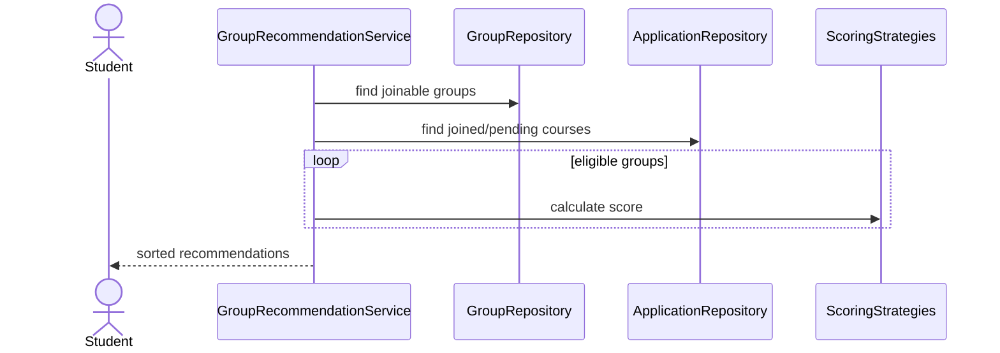

### Notification

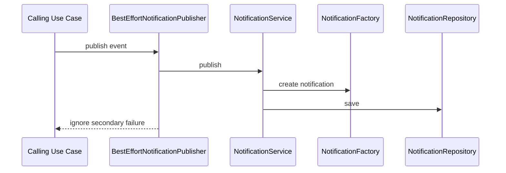

### Admin Report Handling

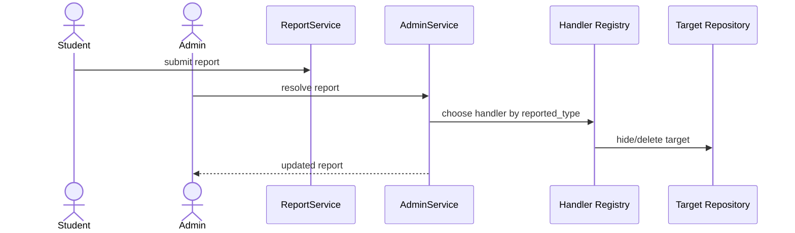

### Announcement

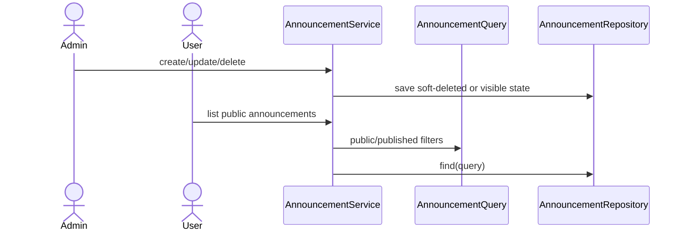

### Schedule Sync

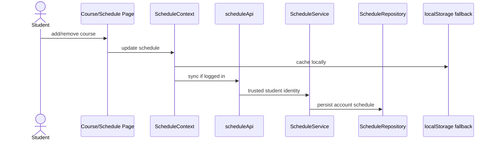

## Appendix D: File Index

### Backend Core

| File | Purpose |
| --- | --- |
| `backend/app.py` | Flask composition root; creates repositories/services and registers routes |
| `backend/mongo.py` | MongoDB and GridFS connection |
| `backend/departments.py` | Department data provider for registration/profile UI |
| `backend/models.py` | Legacy empty model file; domain models live in `backend/models/` |
| `backend/utils/student_id_parser.py` | Student ID parsing helper |
| `backend/requirements.txt` | Backend Python dependencies |
| `backend/env.example` | Backend environment variable template |
| `render.yaml` | Render deployment configuration |

### Backend Models

| File | Purpose |
| --- | --- |
| `models/user.py` | User, Student, Admin profile data and counters |
| `models/course.py` | Course entity and `CourseSearchCriteria` |
| `models/review.py` | Review validation, edit, like, visibility behavior |
| `models/discussion.py` | Discussion and reply domain behavior |
| `models/reply.py` | Reply domain behavior |
| `models/group.py` | Group lifecycle and membership invariants |
| `models/application.py` | Group application status lifecycle |
| `models/schedule.py` | Account schedule course snapshots |
| `models/notification.py` | Notification entity and factory |
| `models/report.py` | Report reasons, status, resolve/withdraw behavior |
| `models/announcement.py` | Announcement entity and query object |
| `models/bookmark.py` | Bookmark entity and factory |
| `models/badge.py` | Badge entity and validation |

### Backend Repositories

| File | Purpose |
| --- | --- |
| `announcement_repository.py` | Announcement queries, active count, save |
| `application_repository.py` | Application insert/update/query operations |
| `badge_repository.py` | Badge lookup and persistence |
| `bookmark_repository.py` | Bookmark idempotent insert/delete/count |
| `course_repository.py` | Course search and lookup |
| `discussion_repository.py` | Discussion persistence and counters |
| `group_repository.py` | Group lifecycle persistence, membership checks, recommendation queries |
| `notification_repository.py` | Notification query, save, mark read |
| `reply_repository.py` | Reply persistence, lookup, hide/delete |
| `report_repository.py` | Report query, save, duplicate prevention, counts |
| `review_repository.py` | Review CRUD, visibility, like, course aggregation source |
| `schedule_repository.py` | Account schedule persistence |
| `student_repository.py` | Student/admin lookup, update, uniqueness helpers |

### Backend Routes

| File | Purpose |
| --- | --- |
| `auth_routes.py` | Login/register HTTP adapter |
| `user_routes.py` | Profile, avatar, departments HTTP adapter |
| `course_routes.py` | Course search/detail HTTP adapter |
| `review_routes.py` | Review lifecycle HTTP adapter |
| `discussion_routes.py` | Discussion/reply HTTP adapter |
| `group_routes.py` | Group lifecycle and recommendation HTTP adapter |
| `application_routes.py` | Group application HTTP adapter |
| `notification_routes.py` | Notification list/read HTTP adapter |
| `report_routes.py` | Student report submit/query/withdraw HTTP adapter |
| `admin_routes.py` | Admin audit, announcement, analytics HTTP adapter |
| `announcement_routes.py` | Public announcement HTTP adapter |
| `bookmark_routes.py` | Bookmark HTTP adapter |
| `schedule_routes.py` | Account schedule HTTP adapter |
| `achievement_routes.py` | Achievement score/badge HTTP adapter |

### Backend Services

| File | Purpose |
| --- | --- |
| `services/auth/auth_service.py` | Registration factory and login strategies |
| `services/auth/authorization_service.py` | JWT identity extraction and route guards |
| `services/auth/password_service.py` | Password hashing and verification |
| `services/auth/token_service.py` | JWT generation and verification |
| `services/profile/user_service.py` | Profile and avatar use cases |
| `services/profile/avatar_storage.py` | GridFS avatar adapter |
| `services/course/course_service.py` | Course query use case |
| `services/review/review_service.py` | Review lifecycle orchestration |
| `services/review/course_rating_synchronizer.py` | Course rating projection sync after review changes |
| `services/discussion/discussion_service.py` | Discussion/reply use cases |
| `services/group/group_service.py` | Group lifecycle orchestration |
| `services/group/application_service.py` | Group application submit/approve/reject/cancel |
| `services/group/group_management_facade.py` | Profile group management read model |
| `services/group/group_recommendation_service.py` | Group recommendation orchestration |
| `services/group/group_recommendation_strategies.py` | Recommendation scoring strategies |
| `services/admin/admin_service.py` | Admin report handler registry and actions |
| `services/admin/admin_analytics_service.py` | Admin dashboard summary read model |
| `services/communication/notification_service.py` | Notification publish/read and best-effort decorator |
| `services/communication/announcement_service.py` | Announcement lifecycle |
| `services/communication/report_service.py` | Student report submit/query/withdraw |
| `services/engagement/favorite_service.py` | Bookmark use cases |
| `services/engagement/achievement_service.py` | Achievement score and badge eligibility |
| `services/engagement/schedule_service.py` | Account schedule sync use cases |

### Backend Scripts, Migrations, Tests

| File | Purpose |
| --- | --- |
| `migrations/group_data_migration.py` | Group/application data normalization and index setup |
| `scripts/migrate_group_data.py` | CLI runner for group migration |
| `scripts/seed_courses.py` | Course seed/import runner |
| `scripts/seed_badges.py` | Default badge seed runner |
| `tests/test_*_use_case.py` | Backend use case unit tests |
| `tests/test_group_api_integration.py` | Group API integration flow |
| `tests/test_group_migration.py` | Migration dry-run/apply/conflict tests |

### Frontend Root And Config

| File | Purpose |
| --- | --- |
| `frontend/src/main.tsx` | React entry |
| `frontend/src/App.tsx` | Global providers and router |
| `frontend/src/routes.tsx` | Lazy-loaded route map and guards |
| `frontend/src/config/api.ts` | API base URL |
| `frontend/src/utils/errors.ts` | Shared error message helper |
| `frontend/vite.config.ts` | Vite, React, Tailwind, alias config |
| `frontend/tsconfig*.json` | TypeScript project config |
| `frontend/eslint.config.js` | ESLint config |

### Frontend API

| File | Purpose |
| --- | --- |
| `api/apiClient.ts` | Shared HTTP adapter, auth headers, response parsing |
| `api/userApi.ts` | Auth/profile/departments/avatar API |
| `api/courseApi.ts` | Course search/detail API and schedule parser |
| `api/reviewApi.ts` | Review API |
| `api/discussionApi.ts` | Discussion/reply API |
| `api/groupApi.ts` | Group lifecycle and dashboard API |
| `api/applicationApi.ts` | Group application API |
| `api/notificationApi.ts` | Notification list/read API |
| `api/reportApi.ts` | Student/admin report API |
| `api/announcementApi.ts` | Admin/public announcement API |
| `api/bookmarkApi.ts` | Bookmark API |
| `api/scheduleApi.ts` | Account schedule API |
| `api/achievementApi.ts` | Achievement score/badge API |
| `api/adminAnalyticsApi.ts` | Admin analytics summary API |

### Frontend Context And Hooks

| File | Purpose |
| --- | --- |
| `context/AuthContext.tsx` | Auth user/session state and auth localStorage ownership |
| `context/ScheduleContext.tsx` | Schedule state, backend sync, local fallback cache |
| `hooks/useUserProfile.ts` | Profile page data/controller hook |
| `hooks/useGroupmateDiscovery.ts` | Groupmate discovery data/filter/action hook |
| `hooks/useNotifications.ts` | Notification popover data/controller hook |

### Frontend Pages

| File | Purpose |
| --- | --- |
| `pages/Home.tsx` | Landing page |
| `pages/CourseCatalog.tsx` | Course search/list page |
| `pages/CourseDetail.tsx` | Course detail, reviews, discussions, add schedule |
| `pages/Reviews.tsx` | Review list/create page |
| `pages/Discussions.tsx` | Discussion list/create page |
| `pages/DiscussionDetail.tsx` | Single discussion and replies |
| `pages/GroupmatesIntegrated.tsx` | Groupmate discovery composition page |
| `pages/Schedule.tsx` | Personal schedule page |
| `pages/UserProfile.tsx` | Profile tabs composition page |
| `pages/auth/Login.tsx` | Login page |
| `pages/auth/Register.tsx` | Register page |
| `pages/auth/AuthLayout.tsx` | Auth layout wrapper |
| `pages/admin/AdminLayout.tsx` | Admin dashboard layout |
| `pages/admin/AdminSidebar.tsx` | Admin navigation |
| `pages/admin/AnalyticsCards.tsx` | Admin analytics cards |
| `pages/admin/AuditCenter.tsx` | Admin report review queue |
| `pages/admin/ReportSidePanel.tsx` | Report detail/action side panel |
| `pages/admin/AnnouncementEditor.tsx` | Announcement management page |
| `pages/admin/CreateAnnouncement.tsx` | Announcement create form component/page |

### Frontend Feature Components

| File | Purpose |
| --- | --- |
| `components/Layout.tsx` | Main site layout/navigation |
| `components/auth/RouteGuard.tsx` | Frontend role guard |
| `components/home/*` | Home hero, shortcuts, public announcement panel/dialog |
| `components/courseCatalog/*` | Course catalog filters, cards, result summary, load-more UI |
| `components/courseDetail/*` | Course detail overview, syllabus, reviews, discussions tabs |
| `components/reviews/*` | Review filters, write form, report dialog, review feed |
| `components/groupmates/CreateGroupDialog.tsx` | Create groupmate post dialog |
| `components/groupmates/GroupCard.tsx` | Groupmate card and apply action |
| `components/groupmates/GroupFilters.tsx` | Groupmate filter panel |
| `components/groupmates/groupmateOptions.ts` | Groupmate constants, labels, formatting helpers |
| `components/admin/audit/*` | Admin report mapper, audit tabs, report table |
| `components/admin/announcements/*` | Announcement editor header, form, preview, list |
| `components/notifications/NotificationPopover.tsx` | Bell notification popover |
| `components/profile/ProfileHeader.tsx` | Profile header and edit form |
| `components/profile/ProfileStats.tsx` | Profile statistics |
| `components/profile/FavoriteCoursesPanel.tsx` | Favorite course list |
| `components/profile/ReviewsPanel.tsx` | User review list/edit/delete |
| `components/profile/CommunityPanel.tsx` | User discussions and replies |
| `components/profile/AchievementsPanel.tsx` | User achievements |
| `components/profile/ReportsPanel.tsx` | User report history |
| `components/profile/GroupManagementPanel.tsx` | Leader/member group management |
| `components/profile/profileTypes.ts` | Profile view types |
| `components/ui/*.tsx` | Reusable UI primitives |

### Frontend Models

| File | Purpose |
| --- | --- |
| `models/Achievement.ts` | Achievement/badge DTOs |
| `models/Announcement.ts` | Announcement DTOs |
| `models/Application.ts` | Group application DTOs |
| `models/Bookmark.ts` | Bookmark DTOs |
| `models/Group.ts` | Group and group dashboard DTOs |
| `models/Notification.ts` | Notification DTO |
| `models/Report.ts` | Report DTOs |
| `models/Auth.ts`, `Course.ts`, `Review.ts`, `User.ts`, `discussion.ts`, `reply.ts` | Legacy/unused contracts kept for now; active contracts mostly live in feature API files |
