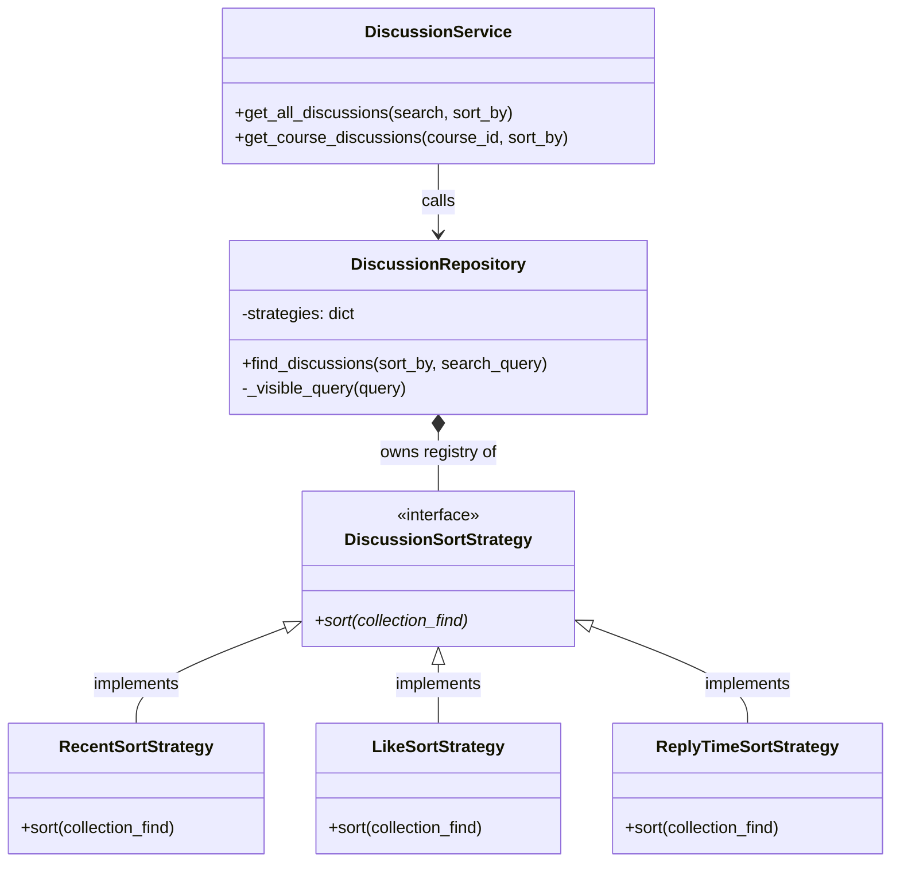

# Purpose

討論區排序機制使用了策略模式（Strategy Design Pattern）。此設計旨在將「排序邏輯」與「資料庫查詢邏輯（Repository）」解耦。

透過定義統一的排序介面，系統允許前端透過單一參數（例如 ?sort_by=active）切換不同的排序演算法，並且在未來新增排序維度（如「爭議度」、「趨勢」）時，完全不需要修改現有的 Repository 或 Service 核心邏輯，符合軟體設計的開放封閉原則（Open/Closed Principle）。

## Responsibility

Component, Responsibility
-DiscussionService,接收 Controller/Route 傳來的 sort_by 參數，並傳遞給 Repository，不干涉實際排序邏輯。

-DiscussionRepository,負責基礎的 MongoDB Query（如關鍵字搜尋、隱藏狀態過濾），並根據收到的 key 將 Cursor 交給對應的 Strategy 進行排序。

-DiscussionSortStrategy,抽象基底類別（ABC），定義統一的 sort() 介面。

-Concrete Strategies,具體的排序實作類別（如 RecentSortStrategy），負責對 MongoDB Cursor 呼叫 .sort()。

# Strategy Resolution Flow
flowchart TD
    A[API Request: ?sort_by=active] --> B[Service: get_all_discussions]
    B --> C[Repository: find_discussions]
    C --> D[Build Base Query: _visible_query + Search]
    D --> E[Get MongoDB Cursor]
    E --> F{Lookup Strategy in Registry}
    F -->|key: 'newest'| G[RecentSortStrategy]
    F -->|key: 'popular'| H[LikeSortStrategy]
    F -->|key: 'active'| I[ReplyTimeSortStrategy]
    F -->|fallback| G
    G --> J[Apply .sort() to Cursor]
    H --> J
    I --> J
    J --> K[Iterate Cursor & Return Dictionaries]

## Available Strategies
目前系統支援三種具體的排序策略，所有排序皆預設為降冪（Descending, -1）。

1. RecentSortStrategy (最新發布)
Key: newest (預設)

Field: timestamp

Purpose: 呈現最新建立的討論文。適合讓學生快速瀏覽剛發出的問題。

2. LikeSortStrategy (最多愛心)
Key: popular

Field: likeCount

Purpose: 呈現獲得最多 toggle_like 的文章。適合用於挖掘精華文章或高價值討論。

3. ReplyTimeSortStrategy (最近回覆)
Key: active

Field: lastReplyAt

Purpose: 呈現討論熱度。只要有新的 Reply 產生，該篇 Discussion 就會被推到頂部（類似傳統論壇的「推文」機制）。