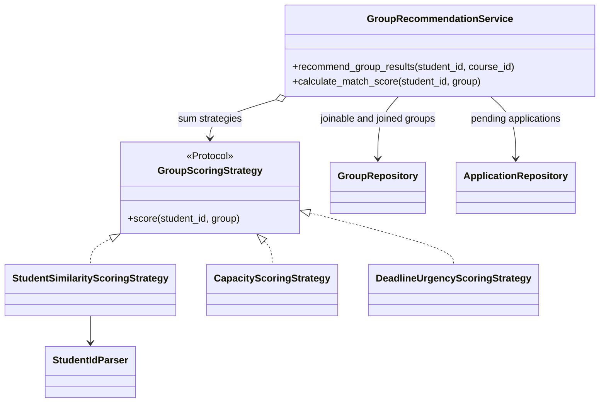
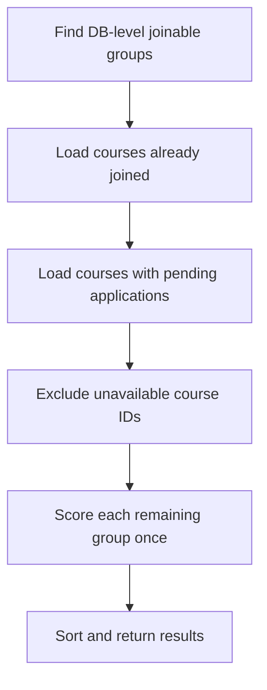

# Group Recommendation Algorithm

## Purpose

組別推薦用於 Find Teammates 頁面。它不是機器學習模型，而是可解釋、可替換的規則式排名。

推薦流程只處理「目前可以申請，而且學生尚未加入或申請同課程組別」的候選群組，再依學生相似度、剩餘容量比例與招募期限排序。

## Responsibility And Design Patterns



| Component | Responsibility | Pattern |
| --- | --- | --- |
| `GroupRepository` | 先在 MongoDB 排除 closed、full、hidden/deleted groups，再由 domain model 檢查 deadline | Repository-side filtering |
| `ApplicationRepository` | 找出學生 pending applications 的課程 | Repository |
| `GroupRecommendationService` | 候選排除、計分組合、排序、回傳 result object | Application Service |
| `GroupRecommendation` | 同時攜帶 group 與已計算 score，避免 route 重算 | Result Object |
| `GroupScoringStrategy` | 統一 scoring extension point | Strategy |
| `StudentSimilarityScoringStrategy` | 比較學生證號資訊 | Strategy |
| `CapacityScoringStrategy` | 依剩餘容量比例給分 | Strategy |
| `DeadlineUrgencyScoringStrategy` | 依截止期限給分 | Strategy |
| `StudentIdParser` | 只解析學生證號，不知道推薦權重 | Single Responsibility |

新增規則時應實作新的 `score(student_id, group)` strategy，再由 composition root 或 service constructor 注入，不要擴大 `GroupRecommendationService` 的條件分支。

## Candidate Filtering

候選 group 必須同時符合：

1. `visibilityState` 是 `VISIBLE` 或舊資料尚未具有此欄位。
2. `status == "open"`。
3. `len(members) < max_members`。
4. 沒有超過 `recruitment_deadline`。
5. 學生尚未加入同一課程的其他 group。
6. 學生沒有同一課程的 pending application。



這些條件不只是 UI disable 規則。真正的資料一致性仍由 submit/approve use case、atomic repository operation 與 membership unique index 保護。

## Student ID Parsing

系統預期學生證號格式為八位數字加一個英文字母，例如：

```text
41271122H
```

| Position | Example | Meaning |
| --- | --- | --- |
| 1 | `4` | Program level: bachelor/master/phd |
| 2-3 | `12` | Admission year |
| 4-5 | `71` | Department code |
| 6 | `1` | Class code |
| 7-8 | `22` | Seat number |
| 9 | `H` | College code |

解析結果：

```python
{
    "student_id": "41271122H",
    "program_level": "bachelor",
    "program_level_code": "4",
    "admission_year": 12,
    "department": "71",
    "class_code": "1",
    "seat_number": "22",
    "college": "H",
}
```

無法解析的學生證號相似度為 `0`，不會讓整個推薦請求失敗。

`StudentSimilarityScoringStrategy._try_parse_student_id()` 使用上限 `4096` 的 LRU cache。學生證號內容不會頻繁變動，因此可避免同一學生在多個 group 中被重複解析，同時限制記憶體成長。

## Scoring Strategies

最終分數是所有 strategy 的加總：

```text
final_score =
student_similarity_score
+ capacity_score
+ deadline_urgency_score
```

### Student Similarity

兩位學生的相似度：

| Condition | Score |
| --- | ---: |
| Same department | +20 |
| Same admission year | +10 |
| Admission year differs by 1 | +5 |
| Same program level | +5 |
| Same class | +5 |
| Same college | +3 |

單一 pair 的最高分是 `43`。

群組相似度會讓 leader 稍微更重要：

```text
leader_similarity = similarity(applicant, leader)

average_member_similarity =
    average(similarity(applicant, each non-leader member))

student_similarity_score =
    (1.2 * leader_similarity + average_member_similarity) / 2.2
```

若 group 只有 leader，`average_member_similarity` 使用 `leader_similarity`，避免新 group 被不合理扣分。

### Capacity

```text
available_slots = max(max_members - member_count, 0)
capacity_score = 10 * available_slots / max_members
```

容量分數介於 `0` 與小於等於 `10` 之間。使用比例而不是固定 `2 * available_slots`，可避免大型 group 單純因上限較大而支配排名。

### Deadline Urgency

| Remaining time | Score |
| --- | ---: |
| Expired | 0 and group should already be filtered out |
| Within 24 hours | +5 |
| Within 72 hours | +3 |
| No deadline or more than 72 hours | +0 |

Naive datetime 會被視為 UTC；正式資料應由 persistence layer 優先儲存 timezone-aware datetime。

## Sorting And Tie Breaking

每個 group 只計算一次，結果包裝成 `GroupRecommendation` 後排序：

```text
1. recommendation score, descending
2. lower occupancy ratio first
3. group ID, descending as deterministic final key
```

實作 key：

```python
(
    recommendation.score,
    -len(group.members) / group.max_members,
    group.group_id,
)
```

排序使用 `reverse=True`。第二個值為負 occupancy ratio，因此成員比例較低的 group 會排前面。

## Complexity

定義：

- `G`: repository 回傳的 joinable groups 數量
- `M`: 每個候選 group 的平均成員數
- `J`: 學生已加入的 group 數量
- `P`: 學生 pending applications 數量

Application 層的時間複雜度：

```text
candidate filtering: O(G + J + P)
scoring:             O(G * M)
sorting:             O(G log G)

total: O(G * M + G log G + J + P)
```

額外空間複雜度：

```text
unavailable course set and results: O(G + J + P)
student ID LRU cache:               O(1) bounded by 4096 entries
```

Repository 在 MongoDB 先排除 closed/full groups，可減少進入 Python 的 `G`。推薦 service 也只計分一次，避免排序或 response serialization 再次計算。

若資料量明顯增加，下一步不是在 Python 內做更多 micro-optimization，而是：

1. 確認 `groups.course_id`、`groups.status`、`groups.members`、applications pending query 有適合的 indexes。
2. 使用 course filter 縮小候選集合。
3. 將常用解析欄位正規化到 student profile，避免依賴學生證號格式。
4. 需要個人偏好時，再加入可注入的新 strategy，例如 meeting mode、study style 或時間衝突。
5. 若排序需跨大量 groups，考慮離線 projection 或 precomputed features。

## Example

Applicant:

```text
41271122H
```

Group:

```text
leader_id = 41271105H
members = [41271105H, 41271218H, 61271103H]
max_members = 4
deadline = within 72 hours
```

假設：

```text
leader_similarity = 43
non_leader_scores = [38, 38]
average_member_similarity = 38

student_similarity = (1.2 * 43 + 38) / 2.2 = 40.73
capacity_score = 10 * (4 - 3) / 4 = 2.5
deadline_score = 3

final_score = 46.23
```

## Correctness Boundaries

推薦結果只是排序與顯示，不是核准保證。使用者送出申請到隊長核准之間，group 可能關閉、額滿、期限到期，或學生已加入其他同課程 group。

因此 `ApplicationService.approve_application()` 必須重新檢查條件，並透過：

- pending application atomic transition
- `group_memberships` unique claim
- `GroupRepository.add_member_if_joinable()`
- 失敗時的 compensating action

保護最終一致性。正式環境執行 group migration 與建立 unique index 後，才能完整抵抗跨 process concurrency。

## Tests

推薦相關 regression tests 位於：

- `backend/tests/test_group_application_use_case.py`
  - 排除已加入課程的 group
  - 限制 capacity weight
  - 每個 group 只計分一次
- `backend/tests/test_group_api_integration.py`
  - group/application/dashboard 整合流程

執行：

```bash
cd backend
python -m unittest discover -s tests -p "test_group_application_use_case.py" -v
python -m unittest discover -s tests -p "test_group_api_integration.py" -v
```
