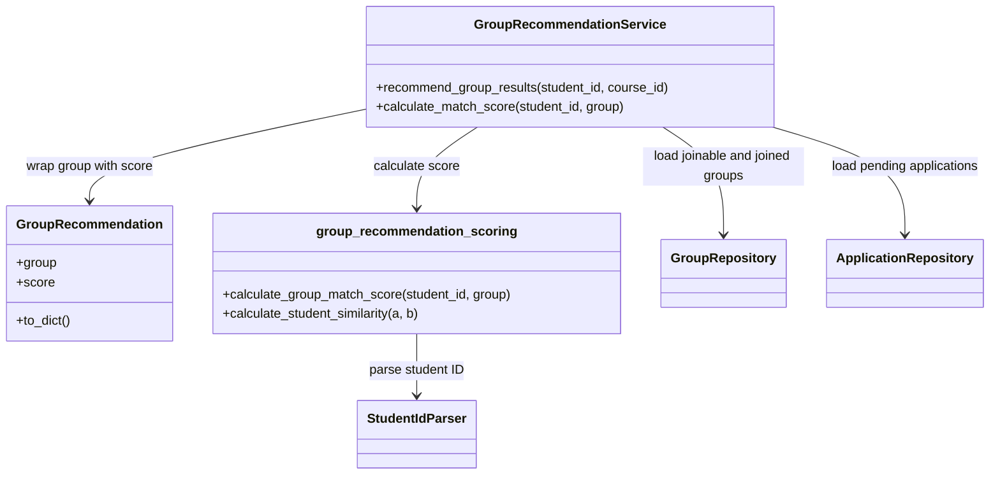
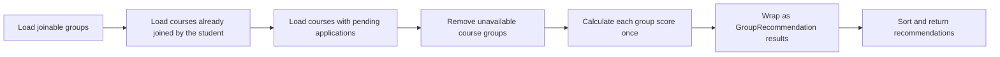

# OOAD Group Recommendation Algorithm Design

## Table of Contents

1. [Overview](#1-overview)
2. [Design Rationale](#2-design-rationale)
3. [System Responsibility](#3-system-responsibility)
4. [Recommendation Flow](#4-recommendation-flow)
5. [Candidate Filtering](#5-candidate-filtering)
6. [Scoring Design](#6-scoring-design)
   - [6.1 Student Similarity](#61-student-similarity)
   - [6.2 Capacity Score](#62-capacity-score)
   - [6.3 Deadline Urgency Score](#63-deadline-urgency-score)
7. [Sorting and Tie-breaking](#7-sorting-and-tie-breaking)
8. [Correctness Boundaries](#8-correctness-boundaries)
9. [Complexity](#9-complexity)

## 1. Overview

The group recommendation feature is used on the Find Teammates page to help students discover suitable groups for a course. It is designed as an explainable rule-based ranking algorithm.

The system first filters out groups that the student cannot currently apply to. These include closed, full, hidden, expired, already joined, or already applied groups. The remaining groups are then ranked by student similarity, available capacity, and recruitment deadline urgency.

This keeps the recommendation logic predictable and makes it easier to separate what each part of the system is responsible for.

## 2. Design Rationale

The group recommendation feature helps students find suitable groups more quickly on the Find Teammates page. In this case, “suitable” is defined by a few clear factors: student background similarity, remaining group capacity, and recruitment deadline. Since these rules are simple and stable for now, a rule-based score is enough for the current requirement.

From an OOAD perspective, the feature separates the recommendation flow, data access, score calculation, and result construction. Repositories handle data storage and query-related work, while the service mainly coordinates the recommendation process. This keeps the service from depending too much on database details.

The recommendation result only decides display priority. It does not guarantee that a student can join the group. The actual application and approval workflow still checks group status, capacity, existing memberships, and pending applications again to avoid inconsistent data.

## 3. System Responsibility

The recommendation feature is divided into components with clear responsibilities. The service mainly coordinates the process, repositories provide group and application data, and the scoring module handles the score calculation.



| Component | Responsibility |
| --- | --- |
| `GroupRecommendationService` | Coordinates the recommendation process, including loading candidate groups, excluding unavailable courses, calculating scores, and sorting results. |
| `GroupRecommendation` | Wraps a group with its calculated recommendation score so the score can be reused when returning results. |
| `GroupRepository` | Provides group queries needed by the recommendation flow, such as joinable groups and groups the student has already joined. |
| `ApplicationRepository` | Provides the student’s pending application data to exclude courses the student has already applied to. |
| `group_recommendation_scoring.py` | Centralizes scoring logic, including student similarity, capacity score, and deadline urgency score. |
| `StudentIdParser` | Parses student ID information used for similarity calculation, but does not handle recommendation weights or ranking logic. |

## 4. Recommendation Flow

The recommendation process starts by loading currently joinable groups. The service then checks which courses the student has already joined a group in, and which courses already have a pending application. Those course IDs are removed from the candidate list.

Each remaining group is scored once, wrapped as a `GroupRecommendation`, sorted, and returned to the route layer.



## 5. Candidate Filtering

Before scoring, the system removes groups that the student should not apply to. This prevents unavailable or irrelevant groups from appearing in the recommendation ranking.

At the repository level, the system first loads joinable groups for the selected course. This excludes groups that are not open, already full, hidden, deleted, or past their recruitment deadline. The service then applies student-specific filtering by removing courses where the student has already joined a group or already has a pending application.

| Rule | Purpose |
| --- | --- |
| Group must be visible and not deleted | Hidden or deleted groups should not appear in recommendation results. |
| Group must be open for recruitment | Closed groups should not accept new applications. |
| Group must not be full | Full groups should not be recommended for application. |
| Group must not be past its recruitment deadline | Expired recruitment should be excluded before scoring. |
| Student must not have already joined a group in the same course | A student can only belong to one group per course. |
| Student must not already have a pending application in the same course | A student should not apply to multiple groups in the same course at the same time. |

The recommendation step only removes groups that are clearly unavailable at the time of ranking. When the student submits an application or when the leader approves it, the backend checks the conditions again.

## 6. Scoring Design

After filtering, each remaining group receives a recommendation score. The score is the sum of student similarity, capacity score, and deadline urgency score.

```text
final_score =
student_similarity_score
+ capacity_score
+ deadline_urgency_score
```

The scoring logic is kept in `group_recommendation_scoring.py`, so `GroupRecommendationService` only needs to call the scoring function.

### 6.1 Student Similarity

Student similarity is calculated from the parsed student ID. The system compares the applicant with the group leader and other members using fields such as department, admission year, program level, class code, and college code.

| Condition | Score |
| --- | ---: |
| Same department | +20 |
| Same admission year | +10 |
| Admission year differs by 1 | +5 |
| Same program level | +5 |
| Same class code | +5 |
| Same college code | +3 |

The group-level similarity score gives the leader slightly more weight:

```text
student_similarity_score =
(1.2 * leader_similarity + average_member_similarity) / 2.2
```

If the group only has a leader, the leader similarity is also used as the member average. This avoids giving new groups an unfairly low similarity score.

### 6.2 Capacity Score

The capacity score gives a small advantage to groups with more available seats. It uses the ratio of available seats instead of the raw number of remaining seats.

```text
available_slots = max(max_members - member_count, 0)
capacity_score = 10 * available_slots / max_members
```

Using a ratio prevents larger groups from ranking higher only because they have a larger member limit. If `max_members` is invalid, the capacity score is set to 0.

### 6.3 Deadline Urgency Score

The deadline urgency score gives a small boost to groups whose recruitment deadline is close.

| Remaining time | Score |
| --- | ---: |
| Expired | 0 |
| Within 24 hours | +5 |
| Within 72 hours | +3 |
| No deadline or more than 72 hours | +0 |

Naive datetime values are treated as UTC before calculating the remaining time. Expired groups should normally be filtered out before scoring, but the scoring function still returns 0 as a safe fallback.

## 7. Sorting and Tie-breaking

After scoring, groups are sorted by recommendation score in descending order.

If two groups have the same score, the system uses occupancy ratio as a tie-breaker. Groups with a lower occupancy ratio are ranked earlier. If both score and occupancy ratio are the same, the group ID is used as the final deterministic tie-breaker.

```python
(
    recommendation.score,
    -len(recommendation.group.members) / recommendation.group.max_members,
    recommendation.group.group_id,
)
```

The list is sorted with `reverse=True`. Because the occupancy ratio is stored as a negative value, a lower occupancy ratio becomes a larger sorting key and appears earlier.

## 8. Correctness Boundaries

The recommendation result only controls display order on the Find Teammates page. It does not guarantee that the student can successfully join the group, because group status may change after the list is generated.

The actual application and approval workflow rechecks the required conditions, including group joinability, course membership, and pending applications.

Final membership correctness is handled by the application service and repository-level operations, not by the recommendation algorithm itself.

## 9. Complexity

Let $G$ be the number of candidate groups, $M$ the average number of members in each group, $J$ the number of groups the student has already joined, and $P$ the number of pending applications.

The main cost comes from scoring each candidate group against its members, which is $O(G \times M)$, followed by sorting, which is $O(G \log G)$. Filtering joined courses and pending applications takes $O(J + P)$.

$$
O(G \times M + G \log G + J + P)
$$

The extra space complexity is mainly from storing unavailable course IDs and recommendation results, which is $O(G + J + P)$. The student ID parsing cache is bounded, so it does not grow with the number of requests.

